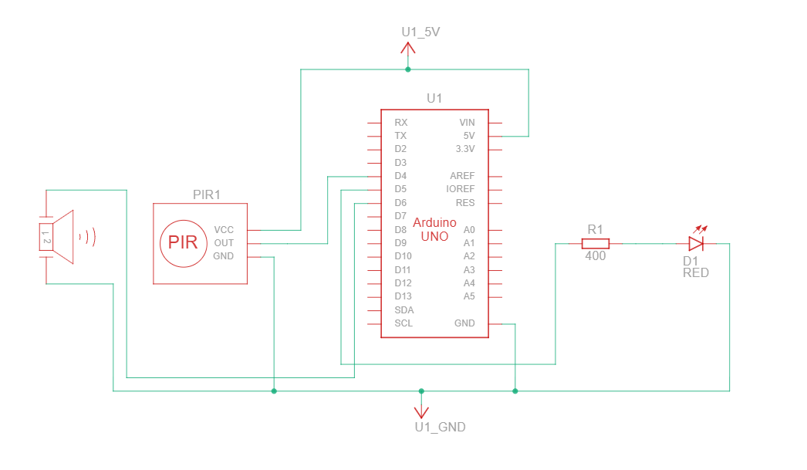
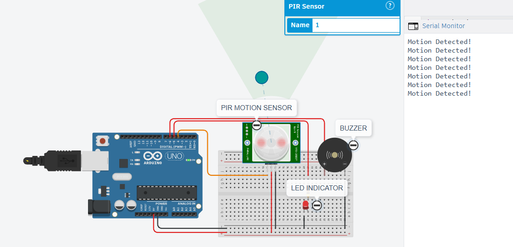
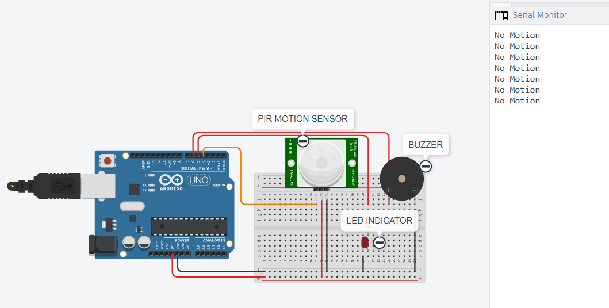

Motion Detection Alarm System using Arduino

 📌 Project Overview

This project is a sensor-based IoT simulation developed using Arduino and Tinkercad. The system detects motion using a PIR (Passive Infrared) sensor and activates an LED and buzzer alarm when movement is detected.

This project was completed as Task 1 during my Internet of Things (IoT) Internship at CodeAlpha.

 🚀 Features

* Detects motion using a PIR sensor
* Turns ON an LED when motion is detected
* Generates a siren alarm using a buzzer
* Displays motion status on the Serial Monitor
* Simulated using Tinkercad (no physical hardware required)

🛠️ Components Used

* Arduino UNO
* PIR Motion Sensor
* LED
* 220Ω Resistor
* Piezo Buzzer
* Breadboard
* Jumper Wires

🔌 Circuit Connections

 PIR Sensor

| PIR Pin | Arduino Pin   |
| ------- | ------------- |
| VCC     | 5V            |
| GND     | GND           |
| OUT     | Digital Pin 4 |

 LED

| LED Pin     | Arduino Pin                 |
| ----------- | --------------------------- |
| Anode (+)   | Digital Pin 5               |
| Cathode (-) | GND (through 220Ω resistor) |

Buzzer

| Buzzer Pin   | Arduino Pin   |
| ------------ | ------------- |
| Positive (+) | Digital Pin 6 |
| Negative (-) | GND           |

⚙️ Working Principle

1. The PIR sensor continuously monitors motion.
2. When motion is detected:

   * The LED turns ON.
   * The buzzer generates a siren alarm.
   * "Motion Detected!" is displayed on the Serial Monitor.
3. When no motion is detected:

   * The LED turns OFF.
   * The buzzer stops.
   * "No Motion" is displayed on the Serial Monitor.
     
📸 Simulation Output

* Circuit Diagram Screenshot:-
  
  
* Motion Detected Output Screenshot:-
  
  
* No Motion Output Screenshot:-
  

📚 Learning Outcomes

* Arduino programming fundamentals
* PIR sensor interfacing
* Digital input and output operations
* Alarm system implementation
* IoT simulation using Tinkercad
* Embedded systems basics

 🎯 Internship Information
 
Organization: CodeAlpha

Internship Domain: Internet of Things (IoT)

Task: Task 2 – Sensor-Based Simulation

👨‍💻 Author

Harsh Jain

GitHub: https://github.com/HarshJain2006

LinkedIn: www.linkedin.com/in/hj06

📄 License

This project is created for educational and learning purposes.
